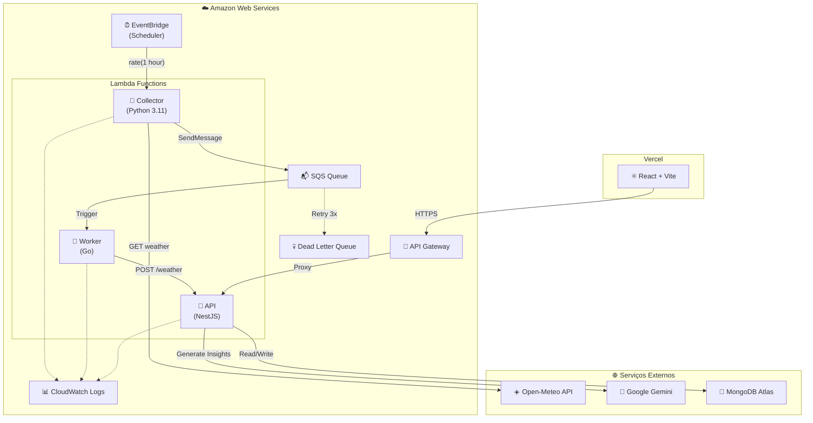

# 🌤️ GDASH Weather Dashboard

Sistema de monitoramento climático em tempo real com pipeline de dados, insights de IA e dashboard interativo.

## 📹 Vídeo Explicativo

[](https://www.youtube.com/watch?v=P3XEtnWcFPE)

**Link direto:** https://www.youtube.com/watch?v=P3XEtnWcFPE

---

## 🌐 URLs de Produção

| Serviço | URL |
|---------|-----|
| **Frontend** | https://frontend-np6jpumiv-jose-duartes-projects-4465d018.vercel.app/ |
| **Backend API** | https://23l4grf3g9.execute-api.us-east-1.amazonaws.com/ |

---

## 🔐 Usuário Padrão

Para acesso inicial ao sistema:

| Campo | Valor |
|-------|-------|
| **Email** | `admin@admin.com` |
| **Senha** | `123456` |

> 💡 Este usuário é criado automaticamente na inicialização do sistema.

---

## 🚀 Como Executar

### Pré-requisitos

- [Docker](https://docs.docker.com/get-docker/) (versão 20.10+)
- [Docker Compose](https://docs.docker.com/compose/install/) (versão 2.0+)
- [Git](https://git-scm.com/)

### Passo 1: Clonar o Repositório

```bash
git clone https://github.com/jose-duarte/desafio-gdash-2025-02.git
cd desafio-gdash-2025-02
```

### Passo 2: Configurar Variáveis de Ambiente

```bash
# Copiar o arquivo de exemplo
cp .env.example .env

# (Opcional) Editar o arquivo .env para personalizar configurações
nano .env
```

**Variáveis importantes:**

| Variável | Descrição | Padrão |
|----------|-----------|--------|
| `GEMINI_API_KEY` | Chave da API do Google Gemini para insights de IA ([Gerar chave](https://aistudio.google.com/api-keys)) | *(opcional)* |
| `JWT_SECRET` | Chave secreta para autenticação JWT | `super-secret-key` |
| `DEFAULT_ADMIN_EMAIL` | Email do usuário admin padrão | `admin@admin.com` |
| `DEFAULT_ADMIN_PASSWORD` | Senha do usuário admin padrão | `123456` |

> 💡 **Nota sobre a API Gemini:** Requer login com conta Google, mas é **gratuita** com limite de 20 requests por dia.

### Passo 3: Executar com Docker Compose

```bash
# Construir e iniciar todos os serviços
docker compose up --build

# Ou em modo background (detached)
docker compose up --build -d
```

### Passo 4: Acessar a Aplicação

Aguarde todos os serviços inicializarem (aproximadamente 30-60 segundos) e acesse:

| Serviço | URL | Descrição |
|---------|-----|-----------|
| **Frontend** | http://localhost | Dashboard principal |
| **API Backend** | http://localhost:3000 | API REST |
| **RabbitMQ Management** | http://localhost:15672 | Gerenciamento da fila (user/password) |

---

## 🐍 Como Rodar o Serviço Python (Collector)

O serviço Python é responsável por coletar dados climáticos da API Open-Meteo.

### Opção 1: Via Docker (Recomendado)

```bash
# Já incluído no docker-compose, mas para rodar isoladamente:
docker compose up collector
```

### Opção 2: Manualmente

```bash
cd microservices/collector

# Criar ambiente virtual
python -m venv .venv
source .venv/bin/activate  # Linux/Mac
# ou: .venv\Scripts\activate  # Windows

# Instalar dependências
pip install -r requirements.txt

# Configurar variáveis de ambiente
export RABBITMQ_HOST=localhost
export RABBITMQ_PORT=5672
export RABBITMQ_USER=user
export RABBITMQ_PASS=password

# Executar
python main.py
```

---

## 🔧 Como Rodar o Worker Go

O worker Go consome mensagens do RabbitMQ e envia dados para a API NestJS.

### Opção 1: Via Docker (Recomendado)

```bash
# Já incluído no docker-compose, mas para rodar isoladamente:
docker compose up worker
```

### Opção 2: Manualmente

```bash
cd microservices/worker

# Configurar variáveis de ambiente
export RABBITMQ_HOST=localhost
export RABBITMQ_PORT=5672
export RABBITMQ_USER=user
export RABBITMQ_PASS=password
export API_URL=http://localhost:3000/weather

# Compilar e executar
go build -o worker .
./worker

# Ou executar diretamente
go run .
```

---

## 📁 Estrutura do Projeto

```
desafio-gdash-2025-02/
├── docker-compose.yml          # Orquestração de todos os serviços
├── .env.example                # Variáveis de ambiente de exemplo
├── microservices/
│   ├── api/                    # Backend NestJS + MongoDB
│   ├── collector/              # Coletor Python (Open-Meteo)
│   ├── frontend/               # React + Vite + Tailwind
│   └── worker/                 # Worker Go (RabbitMQ consumer)
└── infrastructure/             # Configurações de infraestrutura
```

---

## 🔄 Pipeline de Dados

```
Open-Meteo API → Python Collector → RabbitMQ → Go Worker → NestJS API → MongoDB → Frontend
```

1. **Python Collector**: Coleta dados climáticos periodicamente
2. **RabbitMQ**: Fila de mensagens para processamento assíncrono
3. **Go Worker**: Consome e processa mensagens, envia para API
4. **NestJS API**: Armazena dados e gera insights com IA
5. **Frontend React**: Exibe dashboard com dados e insights

---

## 🏗️ Arquitetura de Deploy (AWS)



### Recursos AWS Utilizados

| Serviço | Recurso | Função |
|---------|---------|--------|
| **Lambda** | `gdash-collector` | Coleta dados climáticos (Python 3.11) |
| **Lambda** | `gdash-worker` | Processa fila e envia para API (Go) |
| **Lambda** | `gdash-api` | Backend NestJS (Node.js 20) |
| **SQS** | `weather-queue` | Fila de mensagens assíncrona |
| **SQS** | `weather-dlq` | Dead Letter Queue (retry 3x) |
| **API Gateway** | HTTP API | Expõe endpoints REST |
| **EventBridge** | Scheduler | Dispara coleta a cada hora |
| **CloudWatch** | Logs | Centralização de logs |

### Justificativas

| Componente | Serviço | Por quê? |
|------------|---------|----------|
| **Frontend** | Vercel | Deploy automático, CDN global, zero config |
| **Backend** | AWS Lambda | Serverless, escala automática, pay-per-use |
| **Fila** | SQS | Substituiu RabbitMQ na AWS (nativo, gerenciado) |
| **Scheduler** | EventBridge | Cron serverless, sem servidor dedicado |
| **Database** | MongoDB Atlas | Managed, backups automáticos, free tier |

---

## 🛠️ Stack Tecnológico

| Camada | Tecnologia | Versão |
|--------|------------|--------|
| **Frontend** | React + Vite + Tailwind | React 18, Vite 5 |
| **UI Components** | shadcn/ui + Radix | Componentes acessíveis |
| **Backend** | NestJS + TypeScript | NestJS 10 |
| **Banco de Dados** | MongoDB | 6.0 |
| **Fila** | RabbitMQ | 3.x |
| **Worker** | Go | 1.21+ |
| **Coletor** | Python | 3.11+ |
| **IA** | Google Gemini API | gemini-1.5-flash |

---

## 💡 Decisões Técnicas

### Arquitetura
- **Clean Architecture** no frontend e backend para separação de responsabilidades
- **Microserviços** com comunicação assíncrona via RabbitMQ
- **Event-driven** para desacoplamento entre coleta e processamento

### Performance
- **Lazy loading** de componentes no React
- **Debounce** em requisições de busca
- **Cache** de insights de IA para evitar chamadas desnecessárias

### Segurança
- **JWT** para autenticação stateless
- **Bcrypt** para hash de senhas
- **CORS** configurado para origens permitidas

### UX/UI
- **Design system** consistente com Tailwind
- **Feedback visual** em todas as ações (loading, success, error)
- **Responsivo** para mobile e desktop

---

## 📊 Funcionalidades

- ✅ Dashboard de clima em tempo real
- ✅ Insights de IA (Google Gemini)
- ✅ Exportação de dados (CSV/XLSX)
- ✅ CRUD de usuários com autenticação JWT
- ✅ Integração com API pública paginada (Pokémon)
- ✅ Arquitetura de microserviços
- ✅ Docker Compose para orquestração

---

## 🛑 Para Parar os Serviços

```bash
# Parar todos os serviços
docker compose down

# Parar e remover volumes (dados persistidos)
docker compose down -v
```

---

## 📝 Logs dos Serviços

```bash
# Ver logs de todos os serviços
docker compose logs -f

# Ver logs de um serviço específico
docker compose logs -f api
docker compose logs -f collector
docker compose logs -f worker
docker compose logs -f frontend
```

---

## 🧪 Testes

```bash
# Frontend
cd microservices/frontend
npm install
npm run test

# Backend API
cd microservices/api
npm install
npm run test
```

---

<p align="center">
  Desenvolvido por <a href="https://github.com/jose-duarte">José Duarte</a> 🚀
</p>
